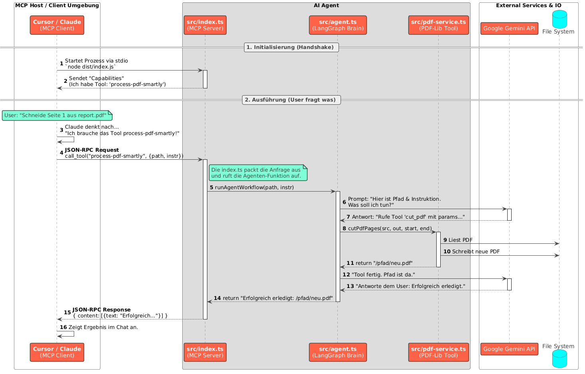

# PDF_Master
Use this overengineered AI agent to cut your pdfs exactly the way you want


# Usage
Be aware that you need a gemini API key for this to work.

1. Build the program with
``` npm run build ```
2. Connecting it to your MCP Client.
E.g. for Cursor IDE add the following to your mcp.json:

```bash
{
  "mcpServers": {
    "pdf-cutter": {
      "command": "node",
      "args": ["PATH_TO_THE_DIST_FOLDER/index.js"],
      "env": {
        "GOOGLE_API_KEY": "YOUR-API-KEY"
      }
    }
  }
}
```

# Process
